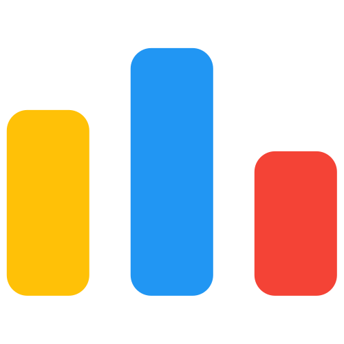

# I'm [Keshav](https://github.com/keshavop)👋

## 
 

<h2 align="center">

</h2>

## About me
### ✨ Creating bugs since  2020
### 📚 I'm a tech nerd
### 🎯 Goals: Hustle to get into 1%
### 🎲 Fun fact: I'm same as you

 

## 🚀 Connect with me

## 👨‍💻Coding Profile

## 🛠️Skills
### I Code in

<!-- ### Web Development
 -->

### Frontend

### Backend

### Tools

## 📊Github Stats

<!-- ## 📊 GitHub Stats:

 -->

### 🐍 Watch Snake eating my contribution

<!-- ## 🏆 GitHub Trophies
 -->

<!--  -->

